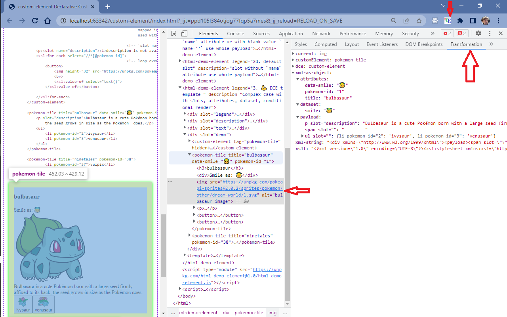

# custom-element-chrome-plugin
devtools helper for [@epa-wg/custom-element][dce-url] as 'Transformation' tab of DOM inspector

[![git][github-image] GitHub][git-url]
| Live demo: [custom-element][demo-url]
| [privacy][privacy-url]

`@epa-wg/custom-element` is based on XSLT template backward compatible with HTML. 
I.e. when plain HTML is used as content, it would be cloned as is. There is no need for much of troubleshooting, 
the DOM inspector suffice. 

But when `slots`, `{}` in attributes, or XSLT constructs like `xsl:if` and `xsl:for` are used in the template,
the ability to look onto data and into actual XSLT under the hood is needed. 

This chrome plugin for devtools DOM inspector comes to rescue. You can see and inspect the data and XSLT, 
copy into string, save to XML/XSLT file and debug in your favorite IDE.

Declarative Custom Element
# Transformation tab of DOM inspector
All fields visibility is available in plugin options

* `current` selected in DOM inspector node
* Parent `customElement`
* `declaration` is a Declarative Custom Element for custom element ^^
* `templatedom` as DCE DOM tree
* `html` string of DCE DOM tree

## Data source for transformation

* `datadom` for easier inspection
* `xml` as a string
* `xslt` as a string

# Debugging
`xml` and `xslt` can be saved to file via for "_copy string contents_" into clipboard.

The XSLT debugger from your favorite IDE can set the breakpoints withing those files and 
run transformation under debugger.

[git-url]:        https://github.com/EPA-WG/custom-element-chrome-plugin
[dce-url]:        https://github.com/EPA-WG/custom-element
[demo-url]:       https://unpkg.com/@epa-wg/custom-element@0.0/index.html
[privacy-url]:    https://github.com/EPA-WG/custom-element-chrome-plugin/blob/main/Privacy.md
[github-image]:   https://cdnjs.cloudflare.com/ajax/libs/octicons/8.5.0/svg/mark-github.svg
